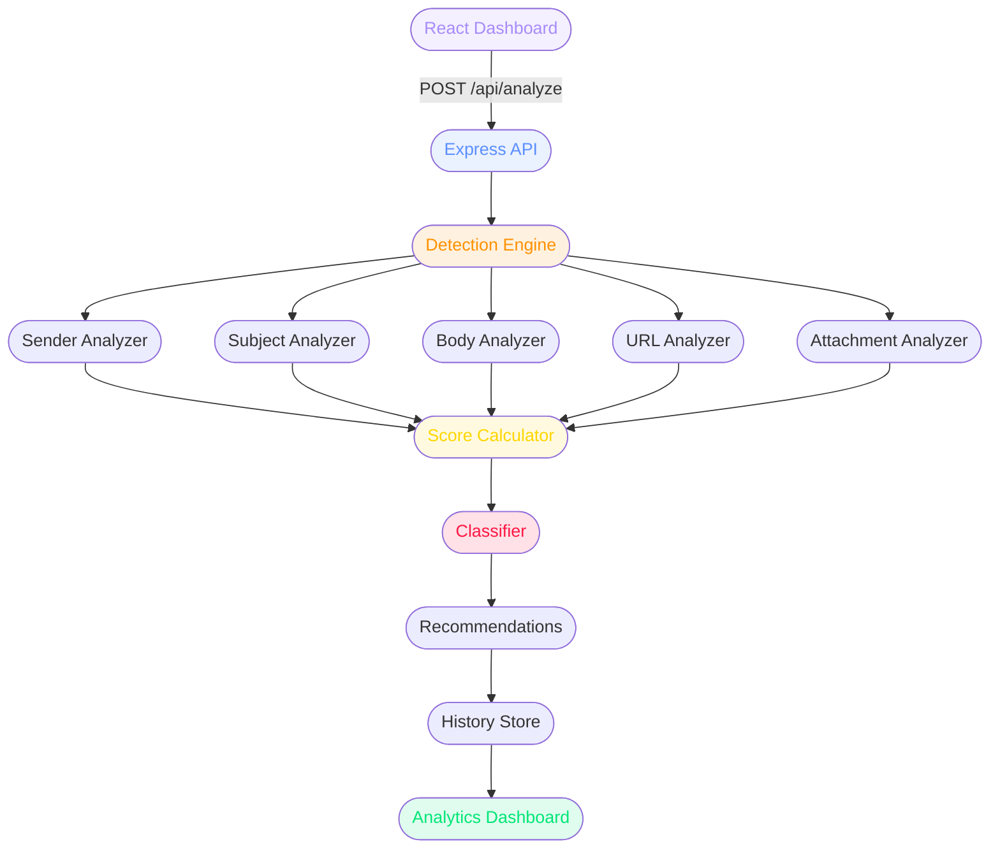

# Phishing Email Detection & Awareness Dashboard


An end-to-end **Phishing Email Detection & Awareness Dashboard** — paste any email, get an instant risk score, phishing indicators, and security recommendations. Built with Node.js + Express backend and React frontend.

🛡️ **[Live Demo →]()**
⭐ **[GitHub →]()**

> ⚠️ **Ethical Notice:** This project is purely defensive and educational. It uses synthetic sample emails only. No real phishing emails are sent, no credentials are harvested, and no attacks are performed against real systems.

---

## What is this project?

Phishing is the #1 initial access vector in cybersecurity breaches. This dashboard simulates what a SOC (Security Operations Center) analyst does when triaging suspicious emails:

1. **Ingest** the email (sender, subject, body, URLs, attachments)
2. **Extract** phishing indicators across 5 categories
3. **Score** the risk from 0–100
4. **Classify** as SAFE / LOW RISK / SUSPICIOUS / HIGH RISK
5. **Explain** exactly why it was flagged
6. **Recommend** security actions
7. **Store** analysis history for trend analytics

---

## Features

- 4-category analysis — sender, subject, body, URL, attachment
- 12+ indicator types — lookalike domains, urgency language, credential requests, suspicious TLDs, raw IP URLs, executable attachments, and more
- Risk score 0–100 with visual gauge
- 4 classification levels — SAFE / LOW RISK / SUSPICIOUS / HIGH RISK
- Explainable decisions — every flag tells you exactly why
- Analysis history — stored locally, queryable
- Real-time analytics dashboard — pie chart, bar chart, stats
- Phishing awareness module — tips + interactive quiz
- Sample email loader — test with pre-built phishing and safe examples
- REST API — fully documented endpoints

---

## Detection Logic

```
Email Input
    │
    ├── Sender Analysis    → lookalike domains, suspicious TLDs,
    │                        hyphenated security keywords, numbers in domain
    │
    ├── Subject Analysis   → urgency words, ALL CAPS, prize/reward language,
    │                        excessive punctuation
    │
    ├── Body Analysis      → fear/threat language, financial pressure,
    │                        credential requests, generic greetings, "click here"
    │
    ├── URL Analysis       → raw IPs, HTTP (not HTTPS), suspicious TLDs,
    │                        URL shorteners, lookalike brand names in URLs
    │
    └── Attachment Analysis → executable extensions, double extensions,
                              script files
          │
          ▼
    Risk Score (0–100) → Classification → Recommendations
```

---

## Risk Classification

| Score | Classification | Color |
|-------|---------------|-------|
| 0–19  | SAFE | 🟢 Green |
| 20–44 | LOW RISK | 🟡 Yellow |
| 45–69 | SUSPICIOUS | 🟠 Orange |
| 70–100 | HIGH RISK / LIKELY PHISHING | 🔴 Red |

---

## Architecture



---

## Project Structure

```
Phishing-Detection-Dashboard/
├── server/
│   ├── engine/
│   │   └── detector.js      # Core detection engine
│   ├── data/
│   │   ├── dataset.json     # Synthetic sample emails
│   │   └── history.json     # Auto-generated analysis history
│   ├── package.json
│   └── index.js             # Express API server
├── client/
│   ├── src/
│   │   ├── components/
│   │   │   ├── Badge.jsx          # Threat classification badge
│   │   │   ├── ScoreGauge.jsx     # Circular risk score gauge
│   │   │   ├── IndicatorCard.jsx  # Individual phishing indicator
│   │   │   ├── BreakdownBar.jsx   # Score breakdown by category
│   │   │   └── StatCard.jsx       # Dashboard stat card
│   │   ├── pages/
│   │   │   ├── AnalyzePage.jsx    # Email input + results
│   │   │   ├── DashboardPage.jsx  # Analytics + charts
│   │   │   ├── HistoryPage.jsx    # Analysis history table
│   │   │   └── AwarenessPage.jsx  # Tips + quiz
│   │   ├── utils/
│   │   │   ├── api.js             # Axios API calls
│   │   │   └── helpers.js         # Color/format utilities
│   │   ├── App.jsx                # Nav + routing
│   │   └── index.css              # Dark theme + CSS variables
│   ├── .env                       # VITE_API_URL
│   └── package.json
└── README.md
```

---

## API Endpoints

| Method | Endpoint | Description |
|--------|----------|-------------|
| GET | `/api/health` | Server health check |
| POST | `/api/analyze` | Analyze an email |
| GET | `/api/history` | Get analysis history |
| DELETE | `/api/history` | Clear history |
| GET | `/api/stats` | Dashboard statistics |
| GET | `/api/dataset` | Get synthetic dataset |

### POST `/api/analyze` — Request body:
```json
{
  "sender":     "security@paypa1.tk",
  "subject":    "URGENT: Account suspended",
  "body":       "Dear customer, verify now or your account will be deleted...",
  "urls":       ["http://paypa1-verify.tk/login"],
  "attachment": "invoice.pdf.exe"
}
```

---

## Local Setup

```bash
# Clone
git clone https://github.com/Neha-Joshi05/Phishing-Detection-Dashboard.git
cd Phishing-Detection-Dashboard

# Backend
cd server
npm install
node index.js
# → running on http://localhost:5000

# Frontend (new terminal)
cd client
npm install
npm run dev
# → running on http://localhost:5173
```

---

## Tech Stack

| Layer | Technology |
|-------|-----------|
| Backend | Node.js + Express |
| Frontend | React 18 + Vite |
| Animation | Framer Motion |
| Charts | Recharts |
| Icons | Lucide React |
| HTTP | Axios |
| Storage | JSON file store |
| Deployment | Vercel (frontend) + Railway (backend) |

---

## Phishing Indicators Detected

**Sender:** Lookalike domains · Suspicious TLDs (.tk .ml .xyz) · Hyphenated security keywords · Numbers in domain

**Subject:** Urgency words · ALL CAPS · Prize/reward claims · Excessive punctuation

**Body:** Fear/threat language · Financial pressure · Credential requests · Generic greetings · "Click here" patterns

**URL:** Raw IP addresses · HTTP (not HTTPS) · URL shorteners · Brand lookalikes in URLs · Suspicious TLDs

**Attachment:** Executable extensions (.exe .bat .vbs) · Double extensions · Script files

---

## Author

**Neha Joshi** — Computer Engineering, AI & Data Science
NVIDIA DLI Certified · IIT Delhi Certified
[GitHub](https://github.com/Neha-Joshi05/Phishing-Detection-Dashboard.git) · [LinkedIn](https://www.linkedin.com/in/neha-joshi-0851a2322?utm_source=share_via&utm_content=profile&utm_medium=member_android)

---